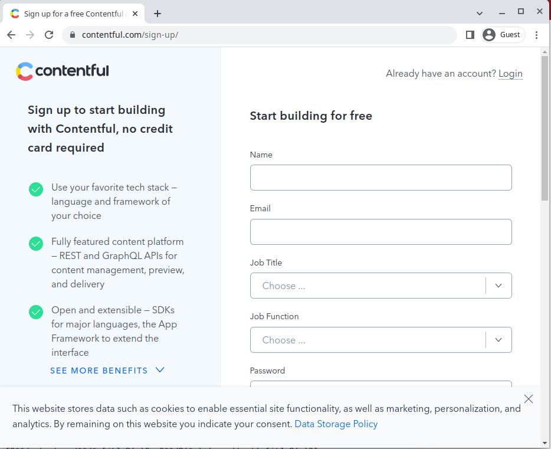
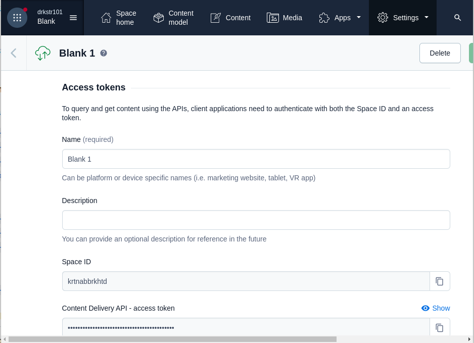

# Stackbit Next.js Starter

Begin a new Stackbit project or learn to add Stackbit to an existing site.

## Getting Started

Get up and running quickly by running the following command:

```txt
npx create-stackbit-app [project-name]
```

Then change into `[project-name]` directory (default: `my-stackbit-site`) and start the Next.js dev server and Stackbit local dev in separate terminal tabs/windows.

```txt
cd [project-name]
yarn dev

# in a separate tab/window
yarn stackbit-dev
```

## Learn the Basics

Follow the [getting started tutorial](https://docs.stackbit.com/getting-started/) while running this project locally to get a feel for how Stackbit works.

Or jump to individual topics [in the docs](https://docs.stackbit.com/).

## Setup Contentful

This example requires a Contentful space. The following steps are needed to set this up.

1. Register a new account with Contentful



2. Copy the `.env.example` file to a file named `.env`, then go to `Settings` -> `API Keys` to fill in the appropriate values.



3. Run `yarn contentful:import` to import the required data into your Contentful space. Use `yarn contentful:export` to persist any remote changes into `contentful/export.json`.

## Support & Feedback

[Join us on Discord](https://discord.gg/HUNhjVkznH) for community support and to provide feedback to us.
